# Data augmentations

## affine augmentation

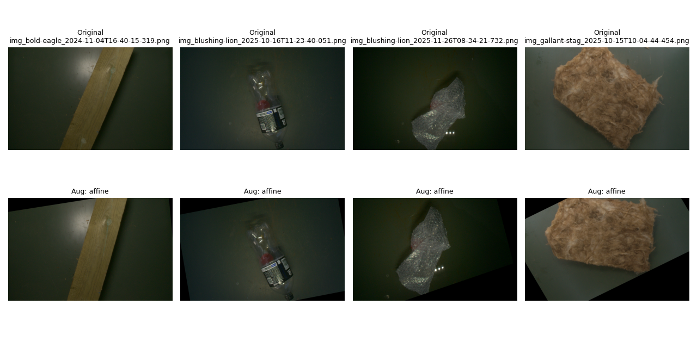

## clahe augmentation

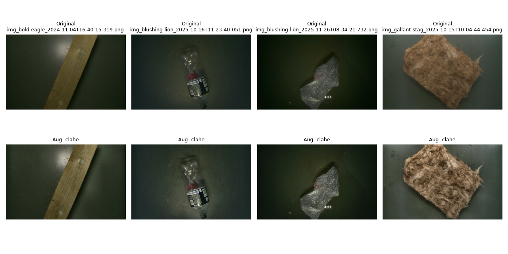

## brightness_contrast augmentation

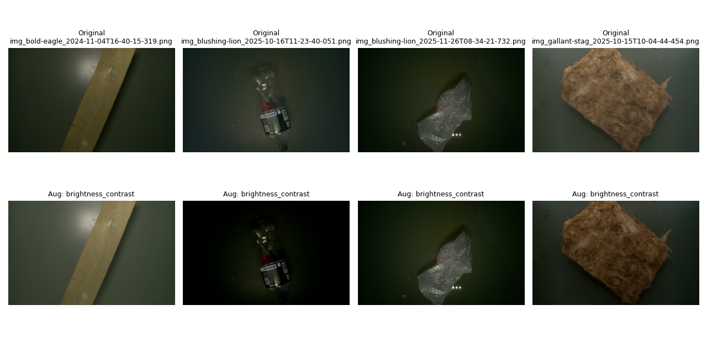

## coarse_dropout augmentation

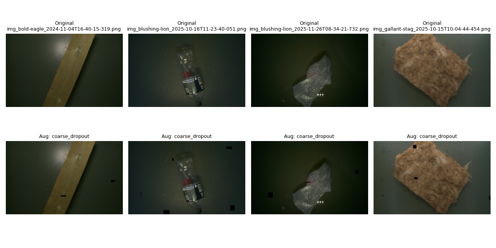

## color_jitter augmentation

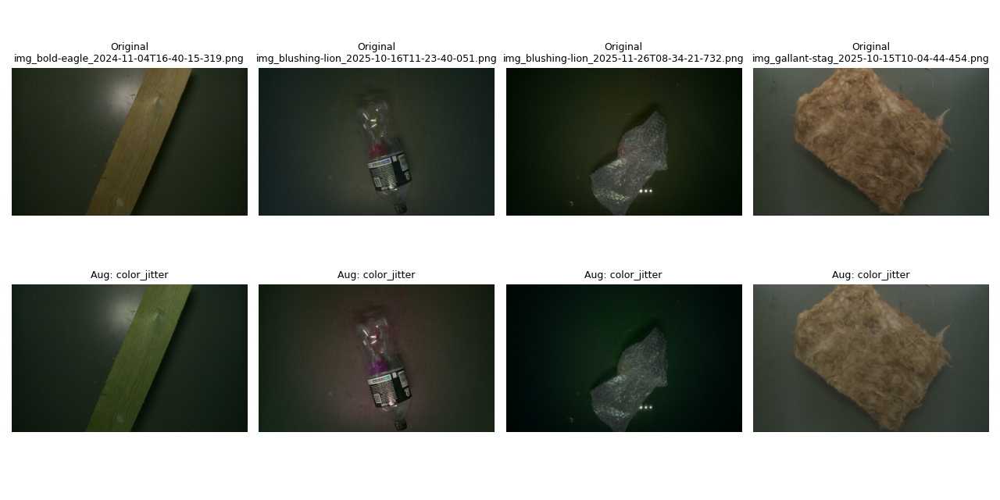

## defocus augmentation

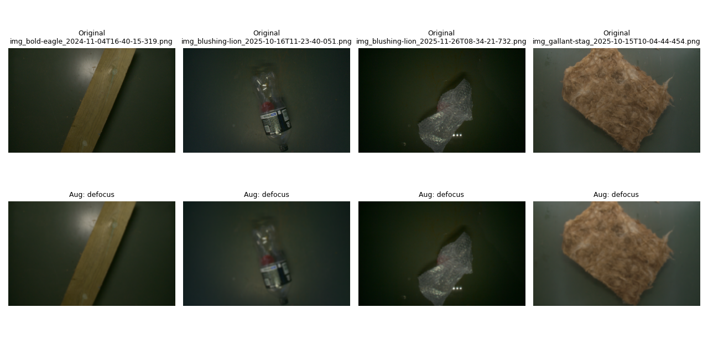

## gauss_noise augmentation

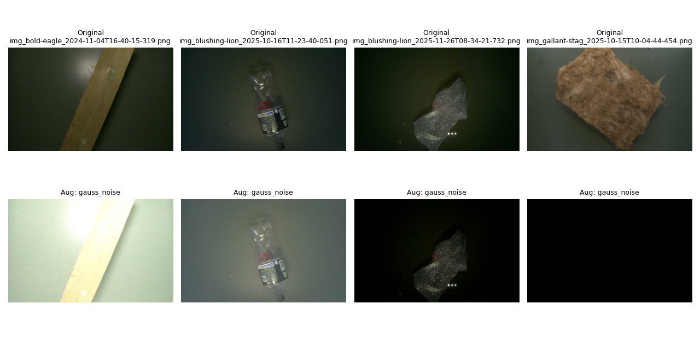

## horizontal_flip augmentation

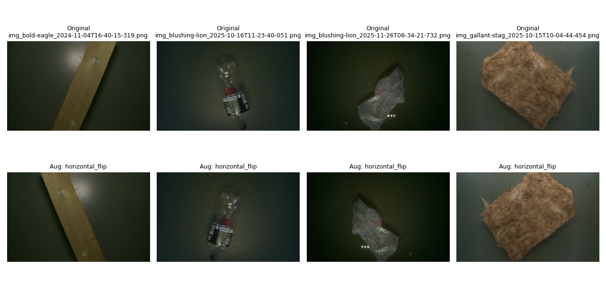

## iso_noise augmentation

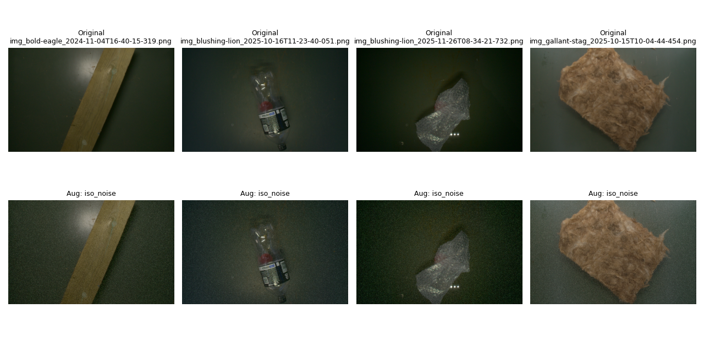

## random_resized_crop augmentation

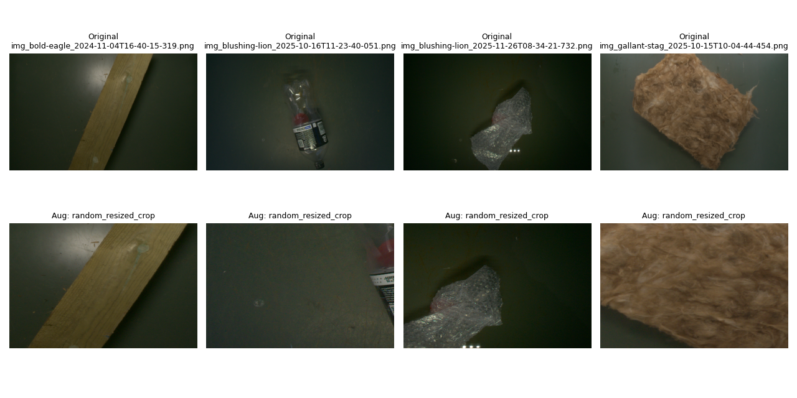

## random_rotate_90 augmentation

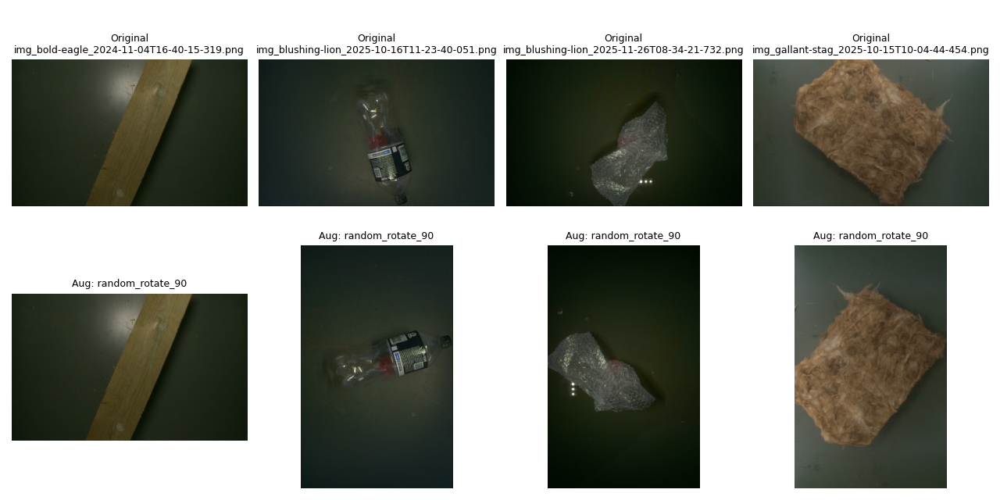

## random_shadow augmentation

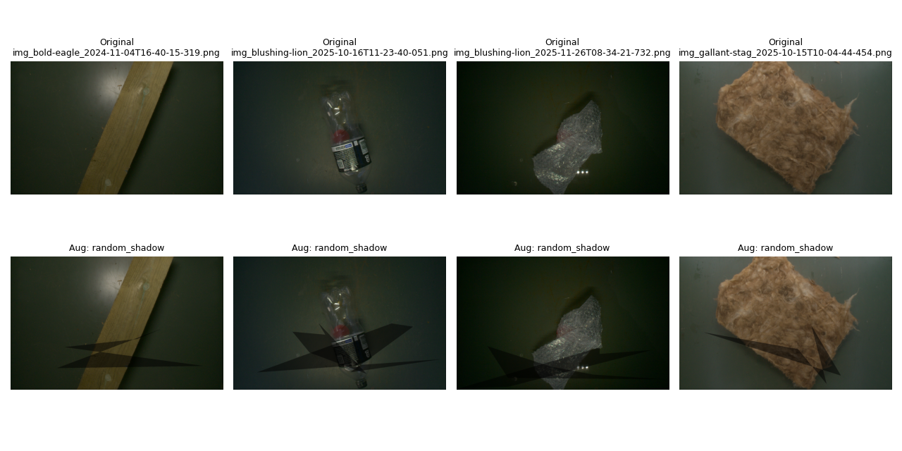

## reszie augmentation

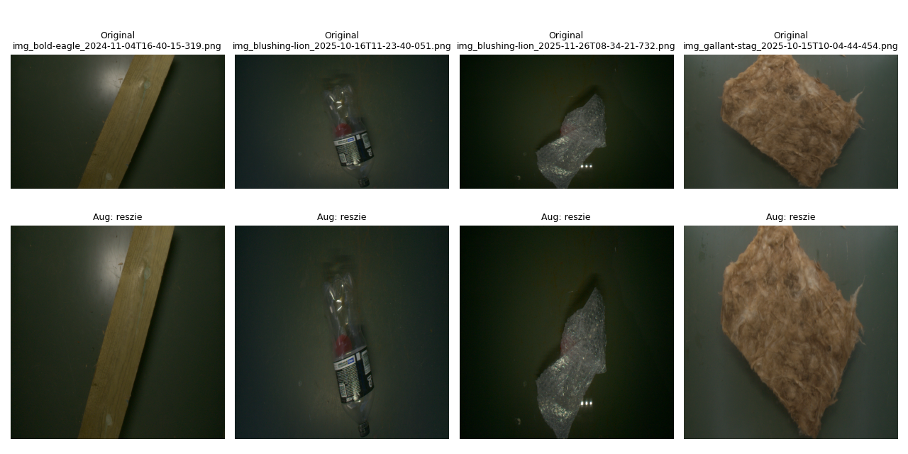

## vertical_flip augmentation

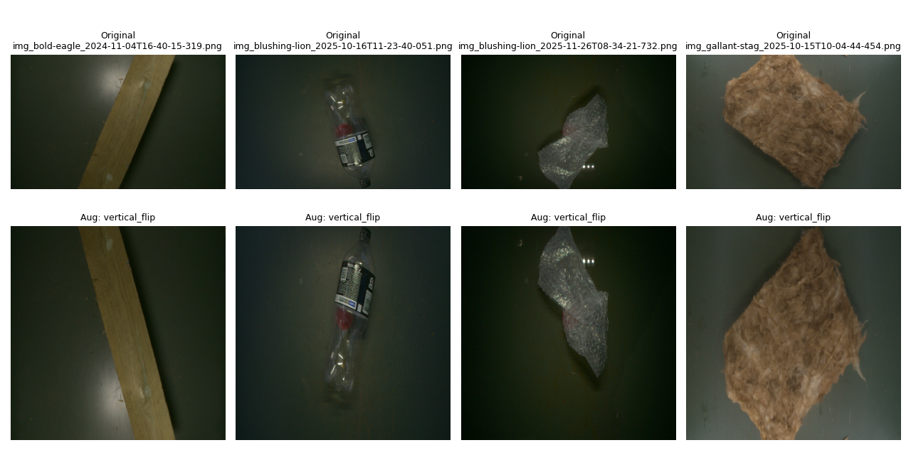

## combined augmentation

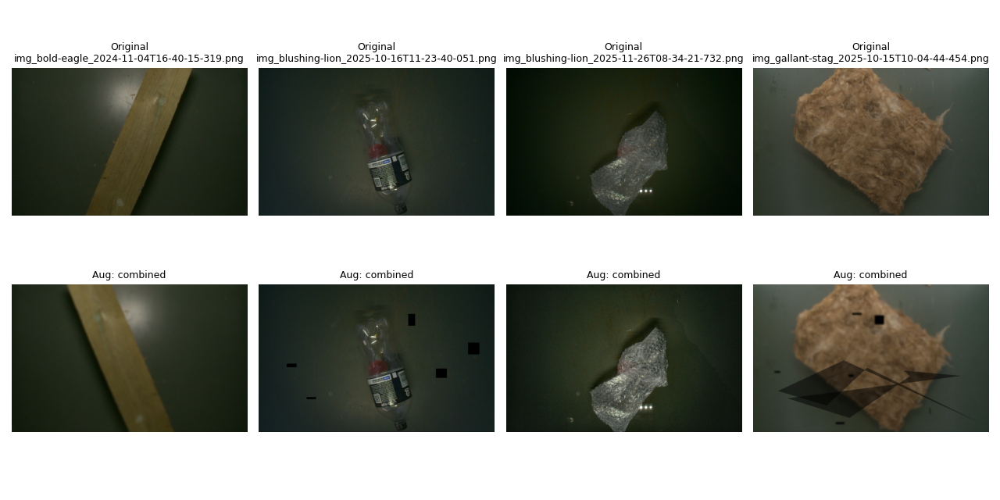

Augmentations:

```json
  "augmentation": {
    "affine": {
      "interpolation": 2,
      "p": 0.0,
      "rotate": {
        "max": 45,
        "min": -45
      },
      "scale": {
        "max": 1.2,
        "min": 0.8
      },
      "shear": {
        "max": 10,
        "min": -10
      },
      "translate_percent": {
        "max": 0.15,
        "min": -0.15
      }
    },
    "brightness_contrast": {
      "brightness_limit": {
        "max": 0.4,
        "min": -0.2
      },
      "contrast_limit": {
        "max": 0.2,
        "min": -0.1
      },
      "p": 0.2
    },
    "clahe": {
      "clip_limit": 2.0,
      "p": 0.25
    },
    "coarse_dropout": {
      "max_height": 100,
      "max_width": 100,
      "num_holes": {
        "max": 8,
        "min": 2
      },
      "p": 0.2
    },
    "color_jitter": {
      "brightness": {
        "max": 1.2,
        "min": 0.8
      },
      "contrast": {
        "max": 1.2,
        "min": 0.8
      },
      "hue": 0.2,
      "p": 0.2,
      "saturation": {
        "max": 1.2,
        "min": 0.8
      }
    },
    "defocus": {
      "alias_blur": {
        "max": 2,
        "min": 1.5
      },
      "p": 0.3,
      "radius": {
        "max": 13,
        "min": 5
      }
    },
    "gauss_noise": {
      "mean_range": {
        "max": 1,
        "min": -1
      },
      "p": 0.0,
      "std_range": {
        "max": 10,
        "min": 9
      }
    },
    "horizontal_flip": {
      "p": 0.4
    },
    "iso_noise": {
      "color_shift": {
        "max": 0.6,
        "min": 0.2
      },
      "intensity": {
        "max": 0.7,
        "min": 0.2
      },
      "p": 0.5
    },
    "random_resized_crop": {
      "height": 400,
      "p": 0.0,
      "ratio": {
        "max": 1.1,
        "min": 0.9
      },
      "scale": {
        "max": 1.0,
        "min": 0.08
      },
      "width": 600
    },
    "random_rotate_90": {
      "p": 0.0
    },
    "random_shadow": {
      "num_shadows_limit": {
        "max": 2,
        "min": 1
      },
      "p": 0.2,
      "shadow_dimension": 5
    },
    "resize": {
      "height": 1200,
      "interpolation": 0,
      "p": 0.0,
      "width": 1200
    },
    "vertical_flip": {
      "p": 0.0
    }
  }
```
